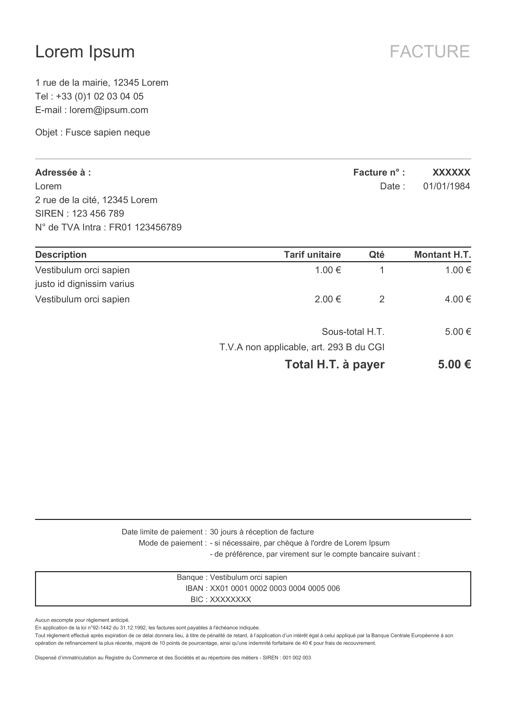

# Générateur de facture

Ce paquet a pour but de créer une facture au format PDF d'après un fichier JSON.

## Fichier JSON

Exemple de la structure attendue :

``` json
{
  "type": "Facture",
  "date": "01/01/1984",
  "invoice_number": "XXXXXX",
  "invoice_object": "Fusce sapien neque",
  "my_company": {
    "name": "Lorem Ipsum",
    "adress": "1 rue de la mairie, 12345 Lorem",
    "phone_number": "+33 (0)1 02 03 04 05",
    "email": "lorem@ipsum.com",
    "siren": "001 002 003",
    "bank": {
      "name":  "Vestibulum orci sapien",
      "iban":  "XX01 0001 0002 0003 0004 0005 006",
      "bic" : "XXXXXXXX"
    }
  },
  "tva": {
    "active": "yes",
    "rate": "21.30",
    "text": "T.V.A. 21.30 %"
  },
  "customer": {
    "name": "Lorem",
    "adress" : "2 rue de la cité, 12345 Lorem",
    "siren": "123 456 789",
    "tva_intra" : "FR01 123456789"
  },
  "item": [
    {
      "description": [
        { "item": "Vestibulum orci sapien" },
        { "item": "justo id dignissim varius" }
      ],
      "amount": 1,
      "unit_price": "1.00"
    },
    {
      "description": [
        { "item": "Vestibulum orci sapien" }
      ],
      "amount": 2,
      "unit_price": "2.00"
    }
  ],
  "limit_date_paiement": "30 jours à réception de facture",
  "paiement_mode": [
    { "kind": "- si nécessaire, par chèque à l'ordre de Lorem Ipsum" },
    { "kind": "- de préférence, par virement sur le compte bancaire suivant :" }
  ],
  "legal_information": "Lorem, S.A.R.L. au capital social de XX € - RCS XXX - N° TVA intracommunautaire : FR 01 234 567 890"
}
```

Le script calcul automatiquement les montants totaux.

## Installation du paquet
```
$ npm i -g make-invoice
```

## Créer une facture

Une fois le paquet installé, lancez la commande suivante pour générer une facture :

```
$ make-invoice
```

Par défaut, le fichier d'entrée est un fichier avec des données de test et le fichier de sortie _invoice.pdf_.
Le fichier sera généré à l'endroit d'où vous lancez la commande.

### Options

Vous pouvez passez à la commande deux options :
```
  --name  le nom et le chemin du PDF de sortie
  --json  l'emplacement d'un JSON à utiliser
```

### Résultats

Quand on génère une facture, on peut la générer avec ou sans la TVA (par exemple pour les auto-entrepreneur). Ce réglage se change dans le fichier _.json_ lu par le script à cet endroit :
``` json
  "tva": {
    "active": "",
    "rate": "XX"
  }
```
Les valeurs à mettre se situent au niveau de la clé ```active```. Si vous mettez comme valeur ```yes``` la TVA est automatiquement calculée, selon la valeur renseignée pour la clé ```rate```.

#### Exemple

Si vous renseignez l'objet ```tva``` de la manière suivante :
``` json
  "tva": {
    "active": "yes",
    "rate": "5"
  }
```
Le script calculera une TVA de 5% et affichera donc les montants H.T., le montant de la TVA ainsi que la somme TTC.

##### Aperçu d'une facture avec la TVA


##### Aperçu d'une facture sans la TVA



## Licence MIT

Copyright (c) 2016 Lionel JAMAL

Permission is hereby granted, free of charge, to any person obtaining a copy of this software and associated documentation files (the "Software"), to deal in the Software without restriction, including without limitation the rights to use, copy, modify, merge, publish, distribute, sublicense, and/or sell copies of the Software, and to permit persons to whom the Software is furnished to do so, subject to the following conditions:

The above copyright notice and this permission notice shall be included in all copies or substantial portions of the Software.

THE SOFTWARE IS PROVIDED "AS IS", WITHOUT WARRANTY OF ANY KIND, EXPRESS OR IMPLIED, INCLUDING BUT NOT LIMITED TO THE WARRANTIES OF MERCHANTABILITY, FITNESS FOR A PARTICULAR PURPOSE AND NONINFRINGEMENT. IN NO EVENT SHALL THE AUTHORS OR COPYRIGHT HOLDERS BE LIABLE FOR ANY CLAIM, DAMAGES OR OTHER LIABILITY, WHETHER IN AN ACTION OF CONTRACT, TORT OR OTHERWISE, ARISING FROM, OUT OF OR IN CONNECTION WITH THE SOFTWARE OR THE USE OR OTHER DEALINGS IN THE SOFTWARE.
